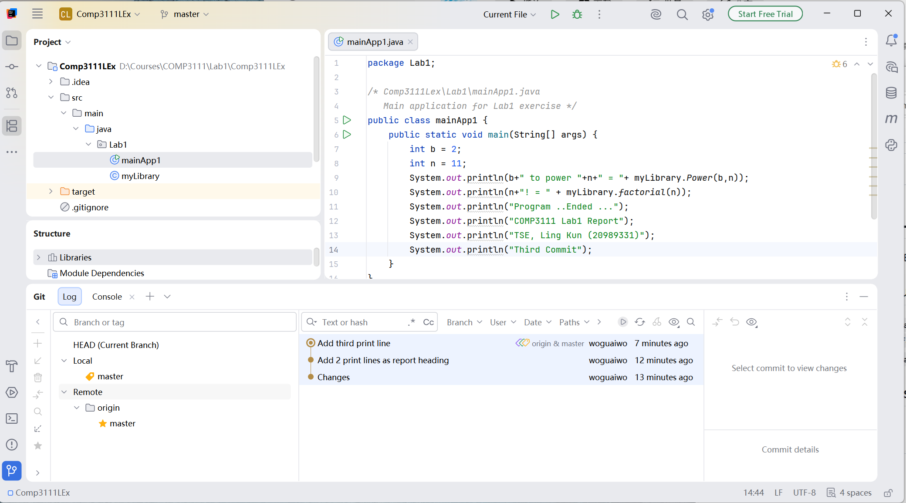

# Lab1 - Introduction to Git & GitHub

COMP3111 Software Engineering

This directory (`src/main/java/Lab1`) contains the two Java classes built
for Lab 1:

- `myLibrary.java` - a class library with two recursive mathematical
  functions: `Power(base, exponent)` and `factorial(n)`
- `mainApp1.java` - the main application. It prints `2^11` and `11!`
  using the functions above, together with a report heading.

## IntelliJ Project Screenshot

The screenshot below shows the Maven project in IntelliJ IDEA, covering
the three major tool windows required by the lab:

1. Project tool window (the `.idea` and `src` spanning tree)
2. Java Class file editor (`mainApp1`)
3. Git | Log tool window with at least three commits

